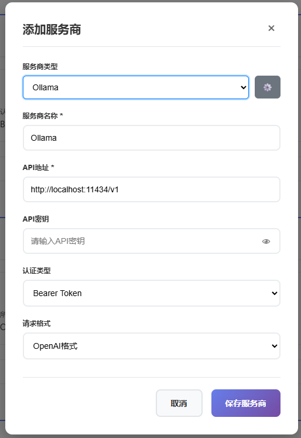
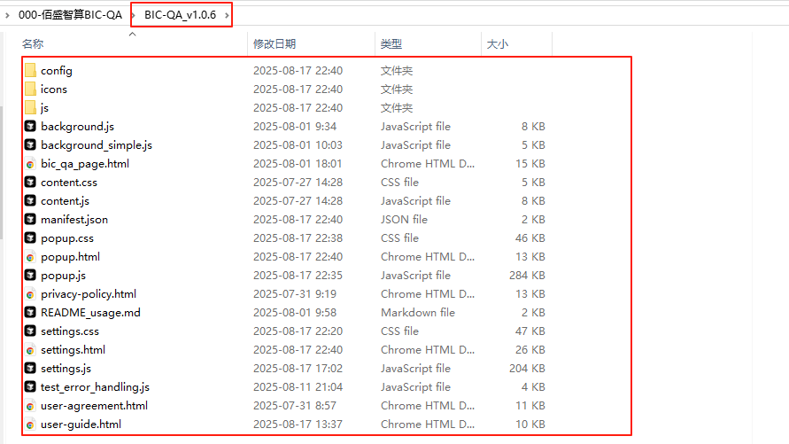

# BIC-QA Intelligent Q&A Assistant

<div align="center">

## 🌐 Language Selection / 语言选择

[](README_ZH.md) [](README.md)

</div>

## 📖 Product Introduction

**BIC-QA (Business Intelligence & Knowledge Query Assistant)** is an intelligent Q&A system specifically designed for enterprise-level database knowledge management. As a next-generation database knowledge retrieval solution, BIC-QA is committed to providing efficient and accurate knowledge query services for database administrators, developers, and operations engineers.

### 🎯 Core Positioning
BIC-QA is a comprehensive database knowledge Q&A platform that supports all mainstream database systems, with deep optimization specifically for domestic database ecosystems. The system integrates rich database knowledge bases covering SQL syntax, performance optimization, troubleshooting, best practices, and comprehensive content, providing users with instant professional database technical support.

### 🗄️ Database Support
- **International Mainstream Databases**: Oracle, MySQL, PostgreSQL, SQL Server, MongoDB, Redis, etc.
- **Domestic Database Priority Support**: DM Database (DM), KingBase, OceanBase, GoldenDB, Huawei GaussDB, Tencent TDSQL, etc.
- **Cloud-Native Databases**: Alibaba Cloud PolarDB, Tencent Cloud TDSQL-C, Huawei Cloud GaussDB, etc.

### 🚀 Technical Advantages
- **Intelligent Semantic Understanding**: Based on advanced NLP technology for accurate user query intent understanding
- **Knowledge Graph Construction**: Builds complete database knowledge association networks for contextually relevant answers
- **Real-time Knowledge Updates**: Continuously updates database version features and best practices
- **Multi-dimensional Retrieval**: Supports precise retrieval by database type, problem type, technical domain, and other dimensions

<div align="center">


**A powerful browser extension providing intelligent Q&A and knowledge base retrieval services**

[](https://chrome.google.com/webstore)
[](https://microsoftedge.microsoft.com/addons)
[](https://github.com/your-repo/BIC-QA)
[](LICENSE)

</div>

<div align="center">

## 🚀 Download Now

[](https://github.com/BIC-QA/BIC-QA/releases/download/v1.0.6/BIC-QA_v1.0.6.zip)

**Version**: v1.0.6 | **Size**: ~15MB | **Updated**: August 2025

</div>

## 📋 Table of Contents

- [🚀 Quick Start](#-quick-start)
- [⚙️ Configuration Guide](#️-configuration-guide)
- [🎯 Usage Instructions](#-usage-instructions)
- [🔧 Advanced Features](#-advanced-features)
- [🛠️ Troubleshooting](#️-troubleshooting)
- [📱 System Requirements](#-system-requirements)
- [🔒 Privacy & Security](#-privacy--security)
- [📞 Technical Support](#-technical-support)

## 🚀 Quick Start

### 📦 Install Extension

1. Download extension files to local machine
2. Open browser extension management page
3. Enable developer mode
4. Click "Load unpacked extension"
5. Select extension folder

### ⚡ Four-Step Configuration

#### Step 1: User Registration


1. Open extension settings page
2. Fill in username, company name, and email address
3. Click **Save** button
4. Check email for API Key

> ⚠️ **Important Reminder**: Do not modify the default URL arbitrarily to avoid affecting plugin operation. If already modified, please reset settings to restore default values.

#### Step 2: Knowledge Base Service Configuration


1. Enter knowledge base service configuration page
2. Fill in the API Key from email into corresponding fields
3. Click **Save** to complete configuration

#### Step 3: AI Model Configuration

##### 3.1 Configure Service Provider Interface


1. Open **Settings** → **Models & Service Providers**
2. Add service providers (such as `ollama`, `deepseek`, etc.)
3. Fill in corresponding **API Address** and **API Key** (if required)

**Local Ollama Configuration Example**:
```bash
API Address: http://localhost:11434/v1
```

4. Click **Test** to connect, system automatically discovers available models
5. Check desired models, click **Batch Management** to save



> 💡 **Tip**: Homepage dropdown menu displays **Model Name (Service Provider)** format to avoid confusion with same-name models.

##### 3.2 Manual Model Configuration


For service providers that don't support auto-discovery:

1. Click **Add Model**
2. Fill in model name, token limit, temperature, and other parameters
3. Click **Save** to complete configuration


#### Step 4: Start Using

1. Select configured **Model (Service Provider)** on homepage
2. Choose target knowledge base from **Knowledge Base** dropdown menu
3. Input question, click **Send** or press Enter
4. Enjoy intelligent Q&A experience!

> 💡 **Usage Tip**: When knowledge base is enabled, system automatically loads latest configuration and prioritizes knowledge base services.

## ⚙️ Configuration Guide

### 🔧 Parameter Rule Settings

BIC-QA supports custom prompts and retrieval parameters with three preset modes:

| Mode | Temperature | Similarity | Use Case |
|------|-------------|------------|----------|
| **Creative Mode** | High | Medium | Requires creative responses |
| **Precise Mode** | Low | High | Requires accuracy priority |
| **Custom Mode** | Adjustable | Adjustable | Fully customizable needs |

**Configurable Parameters**:
- **Prompt**: System instruction template
- **Temperature**: Controls response randomness
- **Similarity**: Knowledge base retrieval threshold
- **TopN**: Number of retrieval results

> ⚠️ **Parameter Impact**: Higher temperature increases creativity, similarity/TopN affects knowledge base retrieval scope and quantity.


## 🛠️ Troubleshooting

### ❗ Common Issues

#### 1. Extension Import Failure

**Possible Causes**:
- File corruption during extraction
- Browser didn't select the innermost folder when choosing plugin

**Solutions**:
- Selected folder should contain manifest.json as shown below:



#### 2. Request Failure
**Possible Causes**:
- Incorrect model service address
- Network connection issues
- Invalid API Key
- Local model permissions not granted

**Solutions**:
```bash
# Check service address
curl http://localhost:11434/v1/models

# Verify network connection
ping your-api-endpoint.com

# Configure local environment variables
Set system variable OLLAMA_ORIGINS to *
```


#### 3. Model Loading Failure
**Possible Causes**:
- Ollama service not started
- Incorrect API address format
- Model not properly deployed

**Solutions**:
```bash
# Start Ollama service
ollama serve

# Check model list
ollama list
```

#### 4. Knowledge Base Connection Failure
**Possible Causes**:
- Incorrect knowledge base service URL
- Expired or invalid API Key
- Network permission restrictions

**Solutions**:
- Check knowledge base service status
- Re-obtain API Key
- Verify network access permissions

### 🔍 Debug Steps

1. **Reload Extension**
   - Open extension management page
   - Click reload button

2. **Clear Cache**
   - Clear browser cache and cookies
   - Restart browser

3. **Check Console**
   - Press F12 to open developer tools
   - View Console error messages

4. **Verify Configuration**
   - Check configuration file format
   - Confirm all required fields

## 📱 System Requirements

### 🌐 Browser Support
- **Chrome** 88+
- **Edge** 88+
- **Other Chromium-based browsers**

### 🌍 Network Requirements
- Support HTTPS/HTTP requests
- Stable network connection
- Firewall allows extension access

## 🔒 Privacy & Security

### 🛡️ Data Protection
- **Local Storage**: Conversation history stored locally
- **Encrypted Transmission**: All network requests use HTTPS
- **Permission Control**: Minimized permission requirements

### 🔐 Security Features
- **Local Models**: Support complete local deployment
- **API Keys**: Secure storage and transmission
- **Access Control**: Configurable network access permissions

### 📋 Privacy Policy
- No collection of personal sensitive information
- No data sharing with third parties
- Support data export and deletion

## 📞 Technical Support

### 🆘 Get Help
- **Community**: Join BIC-QA discussion group


- **Feedback**: Submit issue feedback

### 📧 Contact Information
- **Support Email**: support@dbaiops.com
- **DBAIOps Community:**

- **GitHub**: [Submit Issue](https://github.com/BIC-QA/BIC-QA/issues)

### 🔄 Update Log
- **v1.0.6**: Support for adding large model service providers, fixed known issues
- **v1.0.5**: Performance optimization, fixed known issues
- **v1.0.4**: Added knowledge base functionality
- **v1.0.3**: Support for local Ollama models

---

<div align="center">

**BIC-QA Intelligent Q&A Assistant** - Making knowledge retrieval smarter, making Q&A more efficient

**Version**: v1.0.6 | **Update Date**: August 2025

[⭐ Give us a star](https://github.com/BIC-QA/BIC-QA) | [📖 Documentation](https://docs.bic-qa.com) | [🐛 Report Issues](https://github.com/BIC-QA/BIC-QA/issues)

</div>
