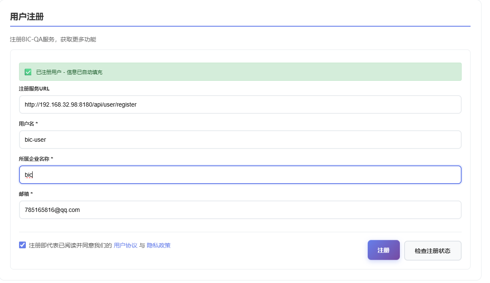
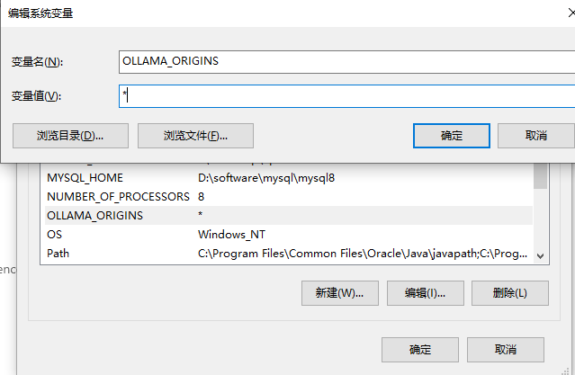

# BIC-QA Intelligent Q&A Assistant

<div align="center">

## 🌐 Language Selection / 语言选择

[](README_ZH.md) [](README.md)

</div>

## 📖 Product Introduction

**BIC-QA (Business Intelligence & Knowledge Query Assistant)** is an intelligent Q&A system specifically designed for enterprise-level database knowledge management. As a next-generation database knowledge retrieval solution, BIC-QA is committed to providing efficient and accurate knowledge query services for database administrators, developers, and operations engineers.

### 🎯 Core Positioning
BIC-QA is a comprehensive database knowledge Q&A platform that supports all mainstream database systems, with deep optimization specifically for domestic database ecosystems. The system integrates rich database knowledge bases covering SQL syntax, performance optimization, troubleshooting, best practices, and comprehensive content, providing users with instant professional database technical support.

### 🗄️ Database Support
- **International Mainstream Databases**: Oracle, MySQL, PostgreSQL, SQL Server, MongoDB, Redis, etc.
- **Domestic Database Priority Support**: DM Database (DM), KingBase, OceanBase, GoldenDB, Huawei GaussDB, Tencent TDSQL, etc.

### 🚀 Technical Advantages
- **Intelligent Semantic Understanding**: Based on advanced NLP technology for accurate user query intent understanding
- **Knowledge Graph Construction**: Builds complete database knowledge association networks for contextually relevant answers
- **Real-time Knowledge Updates**: Continuously updates database version features and best practices
- **Multi-dimensional Retrieval**: Supports precise retrieval by database type, problem type, technical domain, and other dimensions

<div align="center">


**A powerful browser extension providing intelligent Q&A and knowledge base retrieval services**

[](https://chrome.google.com/webstore)
[](https://microsoftedge.microsoft.com/addons)
[](https://github.com/your-repo/BIC-QA)
[](LICENSE)

</div>

<div align="center">

## 🚀 Download Now

[](https://gitee.com/BIC-QA/bic-qa/releases/download/v1.1.1/BIC-QA_v1.1.1.zip)

**Version**: v1.1.1 | **Size**: ~1MB | **Updated**: December 2025

</div>

## 📋 Table of Contents

- [🚀 Quick Start](#-quick-start)
- [⚙️ Configuration Guide](#️-configuration-guide)
- [🔧 Advanced Features](#-advanced-features)
  - [📊 AWR Report Analysis Feature](#-awr-report-analysis-feature)
  - [🔍 Database Inspection Analysis Feature](#-database-inspection-analysis-feature)
  - [⚡ SQL Optimization Analysis Feature](#-sql-optimization-analysis-feature)
  - [🔐 KWR/AWR Report SQL Data Desensitization](#-kwrawr-report-sql-data-desensitization)
- [🛠️ Troubleshooting](#️-troubleshooting)
- [📱 System Requirements](#-system-requirements)
- [🔒 Privacy & Security](#-privacy--security)
- [📞 Technical Support](#-technical-support)

## 🚀 Quick Start

### 📦 Install Extension

1. Download extension files to local machine
2. Open browser extension management page
3. Enable developer mode
4. Click "Load unpacked extension"
5. Select extension folder

### ⚡ Four-Step Configuration

#### Step 1: User Registration



1. Open extension settings page
2. Fill in username, company name, and email address
3. Click **Save** button
4. Check email for API Key

> ⚠️ **Important Reminder**: Do not modify the default URL arbitrarily to avoid affecting plugin operation. If already modified, please reset settings to restore default values.

#### Step 2: Knowledge Base Service Configuration


1. Enter knowledge base service configuration page
2. Fill in the API Key from email into corresponding fields
3. Click **Save** to complete configuration

#### Step 3: AI Model Configuration

##### 3.1 Configure Service Provider Interface


1. Open **Settings** → **Models & Service Providers**
2. Add service providers (such as `ollama`, `deepseek`, etc.)
3. Fill in corresponding **API Address** and **API Key** (if required)

**Local Ollama Configuration Example**:
```bash
API Address: http://localhost:11434/v1
```

4. Click **Test** to connect, system automatically discovers available models
5. Check desired models, click **Batch Management** to save


> 💡 **Tip**: Homepage dropdown menu displays **Model Name (Service Provider)** format to avoid confusion with same-name models.

##### 3.2 Manual Model Configuration


For service providers that don't support auto-discovery:

1. Click **Add Model**
2. Fill in model name, token limit, temperature, and other parameters
3. Click **Save** to complete configuration


#### Step 4: Start Using

1. Select configured **Model (Service Provider)** on homepage
2. Choose target knowledge base from **Knowledge Base** dropdown menu
3. Input question, click **Send** or press Enter
4. Enjoy intelligent Q&A experience!

> 💡 **Usage Tip**: When knowledge base is enabled, system automatically loads latest configuration and prioritizes knowledge base services.

## ⚙️ Configuration Guide

### 🔧 Parameter Rule Settings

BIC-QA supports custom prompts and retrieval parameters with three preset modes:

| Mode | Temperature | Similarity | Use Case |
|------|-------------|------------|----------|
| **Creative Mode** | High | Medium | Requires creative responses |
| **Precise Mode** | Low | High | Requires accuracy priority |
| **Custom Mode** | Adjustable | Adjustable | Fully customizable needs |

**Configurable Parameters**:
- **Prompt**: System instruction template
- **Temperature**: Controls response randomness
- **Similarity**: Knowledge base retrieval threshold
- **TopN**: Number of retrieval results

> ⚠️ **Parameter Impact**: Higher temperature increases creativity, similarity/TopN affects knowledge base retrieval scope and quantity.

## 🔧 Advanced Features

### 📊 AWR Report Analysis Feature

BIC-QA provides a powerful Oracle database AWR (Automatic Workload Repository) report analysis feature that helps database administrators quickly diagnose database performance issues and obtain professional analysis reports and optimization recommendations.

#### 📹 Feature Demo Video

[](assets/BIC-QA%20解析AWR功能使用介绍.mp4)

> 💡 **Tip**: Video playback is not supported directly in Markdown. Please click the button above to download and watch the demo video.

#### 🎯 Feature Overview

The AWR analysis feature can:
- **Intelligent Parsing**: Automatically parse Oracle AWR report HTML format files
- **Deep Analysis**: Comprehensive performance issue diagnosis based on AI large language models
- **Professional Reports**: Generate structured analysis reports including problem diagnosis and optimization recommendations
- **Multi-language Support**: Support for Chinese and English analysis reports
- **History Management**: View and manage historical analysis records with support for re-analysis

> ⚠️ **Version Notice**: The AWR report analysis feature is currently in Beta testing phase. We sincerely invite you to provide valuable feedback and suggestions during use. Your feedback will help us continuously improve the product. The current version has no usage restrictions and all features are available for normal use.

#### 📋 AWR Report Analysis Data Source Notes

**AWR Report Analysis Data Source Notes**:

- ✅ **Supported**: AWR reports from Oracle single-instance databases.
- ✅ **RAC Recommendation**: For RAC environments, please use `awrrpt.sql` or `awrrpti.sql` to generate reports.
- ❌ **Not Currently Supported**: AWR comparison reports generated by `awrddrpi.sql` and global reports generated by `awrgrpt.sql`.

#### 📝 Usage Steps

##### 1. Open AWR Analysis Feature

1. In the left navigation bar, click the **"AWR分析(Analysis)"** button
2. The system will open the AWR analysis dialog

##### 2. Create New Analysis Task

In the **"新建分析 (New Analysis)"** tab, follow these steps:

**Step 1: Fill in System Issue Overview (Optional)**

- In the **"系统问题概述 (System Issue Overview)"** text box, describe the system issues you are experiencing
- Examples: "Database response is slow", "High CPU usage", "Lock wait issues exist", etc.
- ⚠️ **Important Note**: Please provide a relatively clear system issue description. If you are unsure about certain details, it's better not to fill them in to avoid misleading the AI model's analysis results

**Step 2: Fill in Receiving Email (Required)**

- In the **"接收邮箱 (Email)"** input field, enter your email address
- After analysis is complete, the system will send the analysis report to this email
- This field is required (marked with *)

**Step 3: Upload AWR Report File (Required)**

- Click the **"上传文件 (Upload)"** button
- Select the Oracle AWR report HTML file you want to analyze
- Supports standard Oracle AWR report formats (Oracle 10g, 11g, 12c, 19c+, and other versions)
- This field is required (marked with *)

**Step 4: Select Analysis Language**

- In the **"语言 (Language)"** dropdown menu, select the language for the analysis report
- Options: **中文 (Chinese)** or **English**
- The system will generate an analysis report in the selected language

**Step 5: Execute Analysis**

- Confirm all required information is complete
- Click the **"执行分析 (Execute Analysis)"** button to submit the analysis task
- The system will begin processing your AWR report

##### 3. View History Records

In the **"历史记录 (History)"** tab, you can:

**View Analysis History**
- View all submitted AWR analysis task records
- Each record displays the following information:
  - **Create Time**: Time when the task was submitted
  - **Status**: Task execution status (Success/Failed/Processing)
  - **Filename**: Name of the uploaded AWR report file
  - **Description**: Problem description entered during submission
  - **Email**: Email address for receiving reports
  - **Language**: Language of the analysis report

**Filter and Search**
- **Start Time**: Select the start date for the query
- **End Time**: Select the end date for the query
- **Task Status**: Filter by status (All/Success/Failed/Processing)
- Click the **"搜索 (Search)"** button to execute the filter
- Click the **"重置 (Reset)"** button to clear filter conditions

**Re-analyze**
- For historical records, you can click the **"重新分析 (Reanalyze)"** button
- The system will re-execute the analysis task with the same parameters
- Suitable for scenarios where you need to update analysis results or re-analyze with different models

#### 💡 Usage Tips

1. **Accurate Problem Description**: If you clearly know the system issues, it's recommended to describe them in detail to help the AI model analyze related metrics more accurately
2. **Leave Blank When Uncertain**: If you're uncertain about the problem description, it's recommended to leave it blank and let the AI perform a comprehensive analysis
3. **Check Email Address**: Ensure the email address is correct to receive the analysis report in time
4. **Confirm File Format**: Ensure the uploaded file is a standard Oracle AWR report HTML file
5. **Regular History Review**: Through the history function, you can compare analysis results from different periods and track performance trends

#### ⚠️ Important Notes

- AWR Report File Size Limit: Ensure uploaded files do not exceed system limits
- Analysis Processing Time: Depending on report size and complexity, analysis may take several minutes
- Network Connection: Ensure stable network connection for successful file upload and report reception
- Email Reception: Please check your spam folder to ensure you can receive analysis reports normally

#### 🔍 Analysis Report Content

The AWR analysis report generated by the system typically includes the following content:

- **Report Overview**: Basic information such as database version, report time range, etc.
- **Load Profile**: Analysis of overall database load situation
- **Performance Metrics**: Detailed analysis of key performance indicators (such as hit rates, wait events, etc.)
- **Problem Diagnosis**: Identification of potential performance issues and bottlenecks
- **Optimization Recommendations**: Specific optimization recommendations and solutions for identified problems
- **SQL Analysis**: Analysis and optimization recommendations for high-load SQL statements
- **Wait Event Analysis**: Detailed analysis of wait events and handling recommendations

### 🔍 Database Inspection Analysis Feature

BIC-QA provides a powerful database inspection analysis feature that supports automated inspection and diagnosis for mainstream databases such as Oracle and KingBase, helping database administrators comprehensively understand database operating status and promptly identify potential issues.

#### 🎯 Feature Overview

The database inspection analysis feature can:
- **Automated Collection**: Automatically collect database and operating system performance monitoring data through script collectors
- **Comprehensive Diagnosis**: Comprehensive database health status analysis based on AI large language models
- **Professional Reports**: Generate structured inspection reports including performance metrics, problem diagnosis, and optimization recommendations
- **Multi-database Support**: Support for multiple database types such as Oracle, KingBase, etc.
- **Multi-language Support**: Support for Chinese and English analysis reports
- **History Management**: View and manage historical inspection records with support for re-analysis

#### 📝 Usage Steps

##### 1. Open Inspection Diagnosis Feature

1. In the left navigation bar, click the **"巡检诊断 (Inspection Diagnosis)"** button
2. The system will open the inspection diagnosis dialog


##### 2. Download Script Collector

1. In the **"新建诊断 (New Diagnosis)"** tab, select database type
2. Click **"下载脚本采集器链接 (Download Script Collector Link)"** to select the corresponding version collector from the repository
3. Run the script collector on the database server to collect performance data


> 💡 **Tip**: The script collector is the data collection component of the database AI inspection process, automatically executing and returning a series of key inspection indicator raw data (such as space usage, key parameters, wait event statistics, etc.), providing unified and standardized initial datasets for operations personnel or upper-level analysis platforms.

##### 3. Create New Diagnosis Task

In the **"新建诊断 (New Diagnosis)"** tab, follow these steps:

**Step 1: Select Database Type (Required)**
- In the **"数据库类型 (Database Type)"** dropdown menu, select the target database type
- Supports databases such as Oracle, KingBase, etc.

**Step 2: Upload Collection Data (Required)**
- Click the **"上传文件 (Upload File)"** button
- Select the data package file generated by the script collector
- ⚠️ **Important Note**: Only supports uploading client-collected data packages, otherwise analysis will fail

**Step 3: Fill in Receiving Email (Required)**
- In the **"接收邮箱 (Receiving Email)"** input field, enter your email address
- After analysis is complete, the system will send the inspection report to this email

**Step 4: Select Analysis Language**
- In the **"语言 (Language)"** dropdown menu, select the language for the analysis report
- Options: **中文 (Chinese)** or **English**

**Step 5: Submit Diagnosis**
- Read and agree to the disclaimer and security statement
- Click the **"提交诊断 (Submit Diagnosis)"** button to submit the diagnosis task
- The system will begin processing your inspection data

##### 4. View History Records

In the **"历史记录 (History)"** tab, you can:
- View all submitted inspection diagnosis task records
- Filter historical records by time range and task status
- Download historical inspection reports


#### 💡 Usage Tips

1. **Regular Inspections**: It is recommended to perform regular database inspections to promptly identify potential issues
2. **Data Completeness**: Ensure complete data collection using the script collector to avoid missing data affecting analysis results
3. **Sensitive Information Handling**: If data contains sensitive information, it is recommended to perform desensitization processing first
4. **Check Email Address**: Ensure the email address is correct to receive the inspection report in time

### ⚡ SQL Optimization Analysis Feature

BIC-QA provides professional SQL optimization analysis functionality, supporting SQL statement optimization for KingBase databases, helping developers and database administrators improve SQL execution efficiency.

#### 🎯 Feature Overview

The SQL optimization analysis feature can:
- **Intelligent Analysis**: Analyze SQL statement execution plans and performance bottlenecks based on AI large language models
- **Optimization Recommendations**: Provide targeted SQL optimization recommendations and rewriting solutions
- **Professional Reports**: Generate detailed optimization analysis reports including before and after optimization comparisons
- **Multi-language Support**: Support for Chinese and English analysis reports
- **History Management**: View and manage historical optimization records

#### 📝 Usage Steps

##### 1. Open SQL Optimization Feature

1. In the left navigation bar, click the **"SQL优化 (SQL Optimization)"** button
2. The system will open the SQL optimization dialog


##### 2. Download Script Collector

1. In the **"新建优化 (New Optimization)"** tab, select database type (currently supports KingBase)
2. Click **"下载脚本采集器链接 (Download Script Collector Link)"** to select the corresponding version collector from the repository
3. Use the script collector to collect SQL execution-related data


##### 3. Create New Optimization Task

In the **"新建优化 (New Optimization)"** tab, follow these steps:

**Step 1: Select Database Type (Required)**
- In the **"数据库类型 (Database Type)"** dropdown menu, select KingBase

**Step 2: Upload SQL Data File (Required)**
- Click the **"上传文件 (Upload File)"** button
- Select the data file containing SQL statements
- ⚠️ **Important Note**: Only supports uploading client-collected data packages, otherwise analysis will fail

**Step 3: Fill in Receiving Email (Required)**
- In the **"接收邮箱 (Receiving Email)"** input field, enter your email address
- After analysis is complete, the system will send the optimization report to this email

**Step 4: Select Analysis Language**
- In the **"语言 (Language)"** dropdown menu, select the language for the analysis report
- Options: **中文 (Chinese)** or **English**

**Step 5: Submit Optimization**
- Read and agree to the disclaimer and security statement
- Click the **"提交优化 (Submit Optimization)"** button to submit the optimization task
- The system will begin processing your SQL data

##### 4. View History Records

In the **"历史记录 (History)"** tab, you can:
- View all submitted SQL optimization task records
- Filter historical records by time range and task status
- Download historical optimization reports
- Resubmit optimization tasks

#### 💡 Usage Tips

1. **SQL Completeness**: Ensure the uploaded SQL data file contains complete execution context information
2. **Sensitive Information Handling**: If SQL contains sensitive table names, field names, and other information, it is recommended to perform desensitization processing first
3. **Regular Optimization**: For performance-critical SQL statements, it is recommended to perform regular optimization analysis

### 🔐 KWR/AWR Report SQL Data Desensitization

BIC-QA provides KWR/AWR report SQL data desensitization functionality to help users desensitize sensitive SQL information in reports before submitting them for AI analysis, effectively protecting sensitive data security.

#### 🎯 Feature Overview

The data desensitization feature can:
- **Intelligent Desensitization**: Automatically identify and desensitize sensitive SQL information in AWR/KWR reports
- **Security Protection**: Effectively protect sensitive information such as database table names, field names, specific values, etc.
- **Easy to Use**: Provide convenient desensitization tools supporting command-line operations
- **Multi-database Support**: Support for Oracle AWR reports and KingBase KWR reports

#### 📝 Usage Steps

##### 1. Download Desensitization Tool

1. Open the **"AWR分析 (AWR Analysis)"** feature dialog
2. In the **"新建分析 (New Analysis)"** tab, select database type:
   - When selecting **Oracle**, display "AWR脱敏脚本下载地址 (AWR Desensitization Script Download Address)"
   - When selecting **KingBase**, display "KWR脱敏脚本下载地址 (KWR Desensitization Script Download Address)"
3. Click the download link to download the corresponding desensitization tool from Gitee or GitHub

##### 2. Deploy Desensitization Tool

1. Upload the desensitization tool to Linux server
2. Grant executable permissions:

```bash
chmod a+x awr_desensitize
```

##### 3. Execute Desensitization Operation

Run the desensitization tool to process AWR/KWR reports:

```bash
./awr_desensitize -f awrrpt.html
```

> 💡 **Tip**: The desensitized report file will be generated in the current directory, usually with the original filename plus a desensitization identifier.

##### 4. Upload Desensitized Report

Use the desensitized report file for AWR/KWR analysis to ensure sensitive information has been effectively protected.

#### 💡 Usage Tips

1. **Security First**: For reports containing sensitive data, it is strongly recommended to use the desensitization tool before submitting for analysis
2. **Desensitization Scope**: The desensitization tool will process SQL text in reports, including sensitive information such as table names, field names, specific values, etc.
3. **Backup Original Files**: It is recommended to keep backups of original report files for comparison when needed
4. **Verify Desensitization Effect**: After desensitization, it is recommended to check the report content to ensure sensitive information has been correctly desensitized

> ⚠️ **Important Note**: Using the desensitization tool to process SQL text in AWR/KWR reports can effectively protect sensitive information. Processing before AI analysis will be more secure. For security assurance, it is recommended to download and use this desensitization tool.

## 🛠️ Troubleshooting

### ❗ Common Issues

#### 1. Extension Import Failure

**Possible Causes**:
- File corruption during extraction
- Browser didn't select the innermost folder when choosing plugin

**Solutions**:
- Selected folder should contain manifest.json as shown below:


#### 2. Request Failure
**Possible Causes**:
- Incorrect model service address
- Network connection issues
- Invalid API Key
- Local model permissions not granted

**Solutions**:
```bash
# Check service address
curl http://localhost:11434/v1/models

# Verify network connection
ping your-api-endpoint.com

# Configure local environment variables
Set system variable OLLAMA_ORIGINS to *
```


#### 3. Model Loading Failure
**Possible Causes**:
- Ollama service not started
- Incorrect API address format
- Model not properly deployed

**Solutions**:
```bash
# Start Ollama service
ollama serve

# Check model list
ollama list
```

#### 4. Knowledge Base Connection Failure
**Possible Causes**:
- Incorrect knowledge base service URL
- Expired or invalid API Key
- Network permission restrictions

**Solutions**:
- Check knowledge base service status
- Re-obtain API Key
- Verify network access permissions

#### 5. Connection Test Failed, Please Check Network and URL

**Possible Causes**:
- Local network cannot connect to the internet
- Proxy is enabled on this machine
- Network security restrictions

**Solutions**:
- Use network diagnostic tools (such as computer management software) to check if the network is functioning properly

- Manually check if proxy is enabled
   
   

### 🔍 Debug Steps

1. **Reload Extension**
   - Open extension management page
   - Click reload button


2. **Clear Cache**
   - Clear browser cache and cookies
   - Restart browser

3. **Check Console**
   - Press F12 to open developer tools
   - View Console error messages

4. **Verify Configuration**
   - Check configuration file format
   - Confirm all required fields

## 📱 System Requirements

### 🌐 Browser Support
- **Chrome** 88+
- **Edge** 88+
- **Other Chromium-based browsers**

### 🌍 Network Requirements
- Support HTTPS/HTTP requests
- Stable network connection
- Firewall allows extension access

## 🔒 Privacy & Security

### 🛡️ Data Protection
- **Local Storage**: Conversation history stored locally
- **Encrypted Transmission**: All network requests use HTTPS
- **Permission Control**: Minimized permission requirements

### 🔐 Security Features
- **Local Models**: Support complete local deployment
- **API Keys**: Secure storage and transmission
- **Access Control**: Configurable network access permissions

### 📋 Privacy Policy
- No collection of personal sensitive information
- No data sharing with third parties
- Support data export and deletion

## 📞 Technical Support

### 📧 Contact Information
- **Support Email**: support@dbaiops.com
- **DBAIOps Community:**

- **Gitee**: [Submit Issue](https://gitee.com/BIC-QA/BIC-QA/issues)

### 🔄 Update Log
- **v1.1.1**: Added Oracle database inspection analysis, KingBase database SQL optimization analysis, KingBase database inspection analysis, KWR/AWR report SQL data desensitization features
- **v1.0.8.2**: Added multi-language support, fixed known bugs
- **v1.0.7**: Added AWR report analysis feature, supporting Oracle database performance diagnosis
- **v1.0.6**: Support for adding large model service providers, fixed known issues
- **v1.0.5**: Performance optimization, fixed known issues
- **v1.0.4**: Added knowledge base functionality
- **v1.0.3**: Support for local Ollama models

---

<div align="center">

**BIC-QA Intelligent Q&A Assistant** - Making knowledge retrieval smarter, making Q&A more efficient

**Version**: v1.1.1 | **Update Date**: January 2025

[⭐ Give us a star](https://github.com/your-repo/BIC-QA) | [🐛 Report Issues](https://github.com/your-repo/BIC-QA/issues)

</div>
