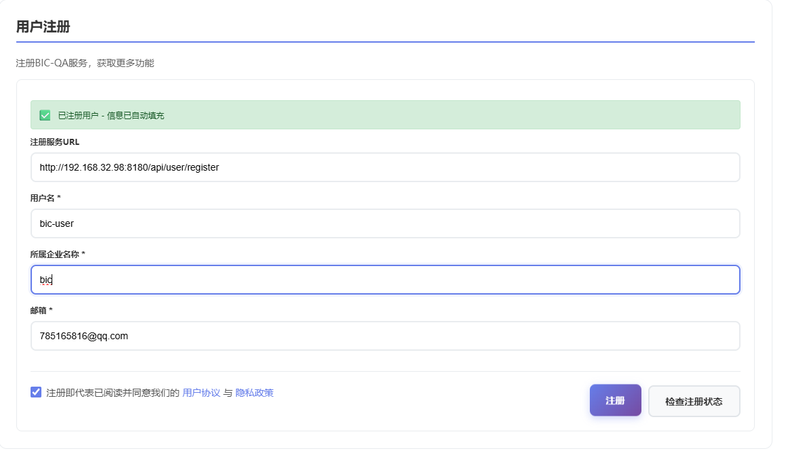
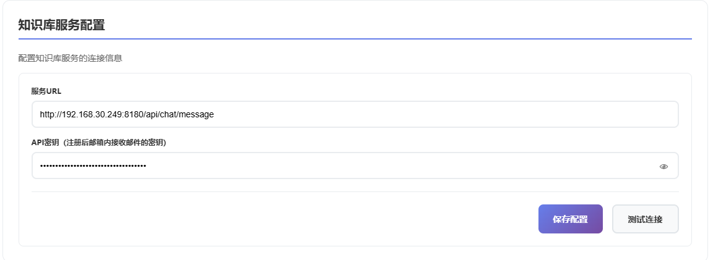
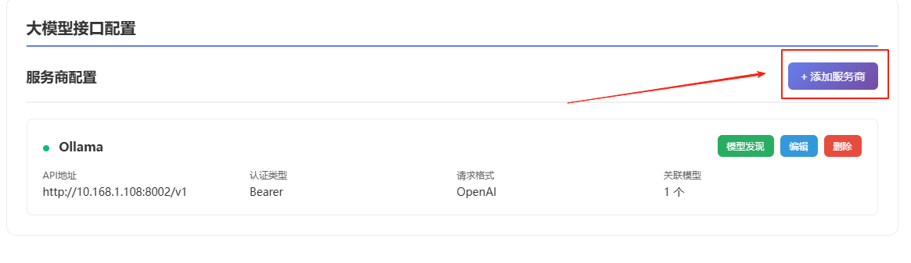
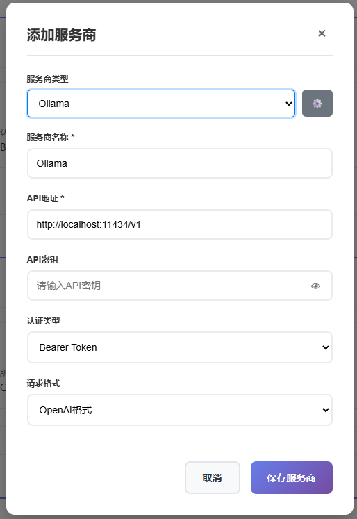
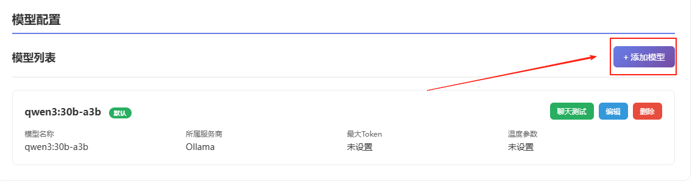
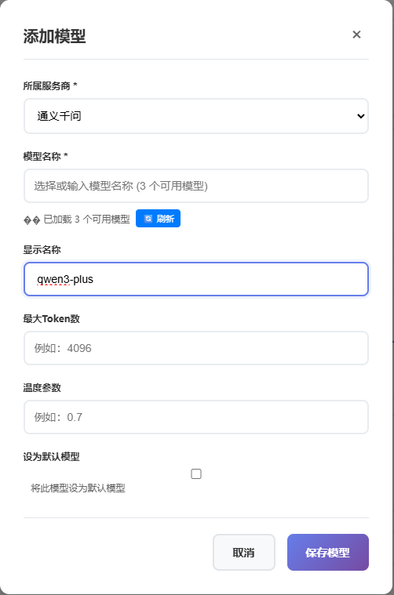
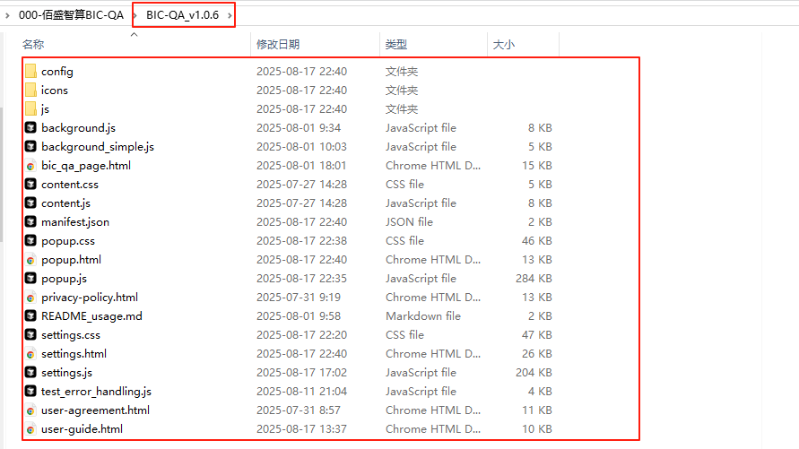
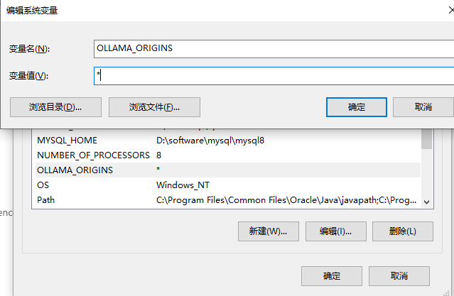

# BIC-QA 智能问答助手

<div align="center">

## 🌐 语言选择 / Language Selection

[](README_ZH.md) [](README.md)

</div>

## 📖 产品介绍

**BIC-QA（Business Intelligence & Knowledge Query Assistant）** 是一款专为企业级数据库知识管理而设计的智能问答系统。作为新一代数据库知识检索解决方案，BIC-QA 致力于为数据库管理员、开发人员和运维工程师提供高效、精准的知识查询服务。

### 🎯 核心定位
BIC-QA 是一个全面的数据库知识问答平台，支持所有主流数据库系统，特别针对国产数据库生态进行了深度优化。系统集成了丰富的数据库知识库，涵盖 SQL 语法、性能优化、故障诊断、最佳实践等全方位内容，为用户提供即问即答的专业数据库技术支持。

### 🗄️ 数据库支持
- **国际主流数据库**：Oracle、MySQL、PostgreSQL、SQL Server、MongoDB、Redis 等
- **国产数据库优先支持**：达梦数据库（DM）、人大金仓（KingBase）、OceanBase、GoldenDB、华为 GaussDB、腾讯 TDSQL 等

### 🚀 技术优势
- **智能语义理解**：基于先进的 NLP 技术，准确理解用户查询意图
- **知识图谱构建**：构建完整的数据库知识关联网络，提供上下文相关的答案
- **实时知识更新**：持续更新数据库版本特性和最佳实践
- **多维度检索**：支持按数据库类型、问题类型、技术领域等多维度精准检索

<div align="center">


**功能强大的浏览器扩展插件，提供智能问答与知识库检索服务**

[](https://chrome.google.com/webstore)
[](https://microsoftedge.microsoft.com/addons)
[](https://github.com/your-repo/BIC-QA)
[](LICENSE)

</div>

<div align="center">

## 🚀 立即下载

[](https://github.com/BIC-QA/BIC-QA/releases/download/v1.0.6/BIC-QA_v1.0.6.zip)

**版本**: v1.0.6 | **大小**: ~15MB | **更新日期**: 2025年8月

</div>

## 📋 目录

- [🚀 快速开始](#-快速开始)
- [⚙️ 配置指南](#️-配置指南)
- [🎯 使用说明](#-使用说明)
- [🔧 高级功能](#-高级功能)
- [🛠️ 故障排除](#️-故障排除)
- [📱 系统要求](#-系统要求)
- [🔒 隐私安全](#-隐私安全)
- [📞 技术支持](#-技术支持)


## 🚀 快速开始

### 📦 安装扩展

1. 下载扩展文件到本地
2. 打开浏览器扩展管理页面
3. 启用开发者模式
4. 点击"加载已解压的扩展程序"
5. 选择扩展文件夹

### ⚡ 四步配置

#### 步骤 1：用户注册



1. 打开扩展设置页面
2. 填写用户名、企业名称和邮箱地址
3. 点击 **保存** 按钮
4. 查收邮件获取 API Key

> ⚠️ **重要提醒**：请勿随意修改默认 URL，以免影响插件正常运行。如已修改，请重置设置恢复默认值。

#### 步骤 2：知识库服务配置



1. 进入知识库服务配置页面
2. 将邮件中的 API Key 填入对应字段
3. 点击 **保存** 完成配置

#### 步骤 3：AI 模型配置

##### 3.1 配置服务商接口



1. 打开 **设置** → **模型与服务商**
2. 添加服务商（如 `ollama`、`deepseek` 等）
3. 填写对应的 **API 地址** 和 **API Key**（如需要）

**本地 Ollama 配置示例**：
```bash
API 地址：http://localhost:11434/v1
```

4. 点击 **测试** 连接，系统自动发现可用模型
5. 勾选所需模型，点击 **批量纳管** 保存



> 💡 **提示**：首页下拉菜单会显示 **模型名（服务商）** 格式，避免同名模型混淆。

##### 3.2 手动配置模型



对于不支持自动发现的服务商：

1. 点击 **添加模型**
2. 填写模型名称、Token 限制、温度等参数
3. 点击 **保存** 完成配置



#### 步骤 4：开始使用

1. 在首页选择已配置的 **模型（服务商）**
2. 从 **知识库** 下拉菜单选择目标知识库
3. 输入问题，点击 **发送** 或按回车键
4. 享受智能问答体验！

> 💡 **使用技巧**：开启知识库后，系统会自动加载最新配置并优先使用知识库服务。

## ⚙️ 配置指南

### 🔧 参数规则设置

BIC-QA 支持自定义提示词和检索参数，提供三种预设模式：

| 模式 | 温度 | 相似度 | 适用场景 |
|------|------|--------|----------|
| **创意模式** | 高 | 中等 | 需要创造性回答 |
| **精确模式** | 低 | 高 | 需要准确性优先 |
| **自定义模式** | 可调 | 可调 | 完全自定义需求 |

**可配置参数**：
- **提示词（Prompt）**：系统指令模板
- **温度（Temperature）**：控制回答随机性
- **相似度（Similarity）**：知识库检索阈值
- **TopN**：检索结果数量

> ⚠️ **参数影响**：温度越高创造性越强，相似度/TopN 影响知识库检索范围和数量。

## 🛠️ 故障排除

### ❗ 常见问题

#### 1. 插件导入失败

**可能原因**：
- 解压出现文件损坏
- 浏览器选择插件时候没有选最后一层文件

**解决方案**：
- 选择的文件夹下有manifest.json,如下所示：



#### 2. 请求失败
**可能原因**：
- 模型服务地址错误
- 网络连接问题
- API Key 无效
- 本地模型权限未放行

**解决方案**：
```bash
# 检查服务地址
curl http://localhost:11434/v1/models

# 验证网络连接
ping your-api-endpoint.com

# 配置本地环境变量
系统变量设置OLLAMA_ORIGINS值为*
```


#### 3. 模型无法加载
**可能原因**：
- Ollama 服务未启动
- API 地址格式错误
- 模型未正确部署

**解决方案**：
```bash
# 启动 Ollama 服务
ollama serve

# 检查模型列表
ollama list
```

#### 4. 知识库连接失败
**可能原因**：
- 知识库服务 URL 错误
- API Key 过期或无效
- 网络权限限制

**解决方案**：
- 检查知识库服务状态
- 重新获取 API Key
- 验证网络访问权限

### 🔍 调试步骤

1. **重新加载扩展**
   - 打开扩展管理页面
   - 点击重新加载按钮

2. **清除缓存**
   - 清除浏览器缓存和 Cookie
   - 重启浏览器

3. **检查控制台**
   - 按 F12 打开开发者工具
   - 查看 Console 错误信息

4. **验证配置**
   - 检查配置文件格式
   - 确认所有必填字段

## 📱 系统要求

### 🌐 浏览器支持
- **Chrome** 88+
- **Edge** 88+
- **其他基于 Chromium 的浏览器**

### 🌍 网络要求
- 支持 HTTPS/HTTP 请求
- 稳定的网络连接
- 防火墙允许扩展访问

## 🔒 隐私安全

### 🛡️ 数据保护
- **本地存储**：对话历史存储在本地
- **加密传输**：所有网络请求使用 HTTPS
- **权限控制**：最小化权限要求

### 🔐 安全特性
- **本地模型**：支持完全本地部署
- **API 密钥**：安全存储和传输
- **访问控制**：可配置网络访问权限

### 📋 隐私政策
- 不收集个人敏感信息
- 不向第三方分享数据
- 支持数据导出和删除

## 📞 技术支持

### 🆘 获取帮助
- **社区**：加入BIC-QA讨论群


- **反馈**：提交问题反馈

### 📧 联系方式
- **售后邮箱**：support@dbaiops.com
- **DBAIOps社区:**

- **GitHub**：[提交 Issue](https://github.com/BIC-QA/BIC-QA/issues)

### 🔄 更新日志
- **v1.0.6**：支持添加大模型服务商，修复已知问题
- **v1.0.5**：优化性能，修复已知问题
- **v1.0.4**：新增知识库功能
- **v1.0.3**：支持本地 Ollama 模型

---

<div align="center">

**BIC-QA 智能问答助手** - 让知识检索更智能，让问答更高效

**版本**：v1.0.6 | **更新日期**：2025年8月

[⭐ 给我们一个星标](https://github.com/BIC-QA/BIC-QA) | [📖 使用文档](https://docs.bic-qa.com) | [🐛 报告问题](https://github.com/BIC-QA/BIC-QA/issues)

</div>
